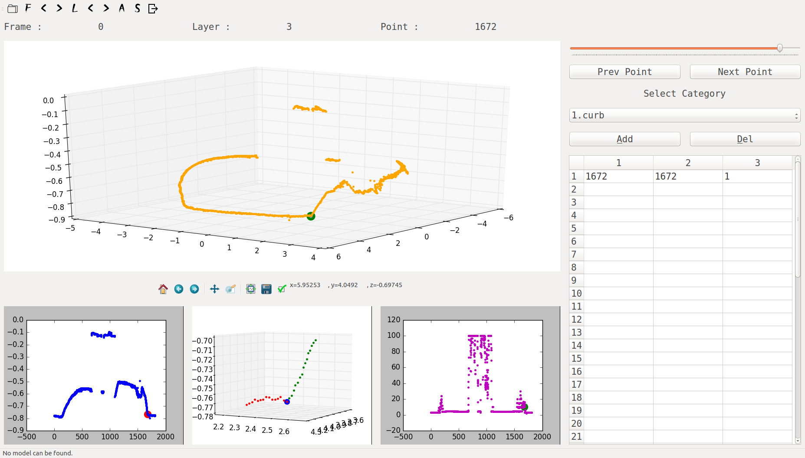

# Curb Detect Tool using Lidar

## 基于激光数据的路缘提取工具

### 依赖
- numpy, scipy, scikit-learn, matplotlib, mat4py
- PyQt4
- ROS Kinetic with Python3 environment

### 组件介绍

- curb_detect_no_ros.py
  - 这是可以直接在Python3环境中运行的代码, 包含了Curb检测的功能, 以及分类器训练的功能.
- ros文件夹
  - 这个文件夹中两个文件, 分别具有发布数据和Curb检测的功能.
- labeltool文件夹
  - 这是一个用PyQt4写的Curb标注工具, 可以标注Curb点, 道路, 以及非道路.

    
- data文件夹
  - 这个文件夹中存放了运行程序需要用到的数据, 都是mat格式, 可以用matlab打开. 此外, 还包括分类器模型以及标注好的数据.
 
#### 如需交流, 请联系 : 852234496@qq.com
